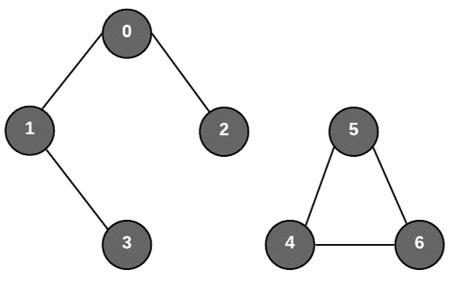

# Lab 5 - Undirected Graphs
In this task you will be coding a [graph](https://en.wikipedia.org/wiki/Graph_(discrete_mathematics)) datastructure implementation **Adjacency Set** which is an Adjacency List that uses sets instead of lists.

The graphs in this assignment are **undirected** and **unweighted**:

`Main.java` contains some code to do simple checks for the graph implementation.

### Task 1
Implement the remaining methods in `AdjacencySet.java`. Methods:
 * `addNode(V node)`
 * `removeNode(V node)`
 * `addEdge(V u, v v)`
 * `removeEdge(V u, V v)`
 * `hasNode(V node)`

✅ Run `AdjacencySetTest` to check your solution. The task is passed if all tests pass.

### Task 2
An essential part of graph theory is to be able to search through a graph. In this task we want to know whether two nodes `u` and `v` are connected.

In the graph above `0` and `2` are connected since there is a direct edge between them. `3` and `2` are also connected since there are nodes inbetween that connect them.   
While `2` and `5`  are not connected since there are noe edges that directly connect them or any inbetween other nodes.

**TODO: Implement `GraphSearch::connected`.**

✅ Run `GraphSearchTest` to check your solution. The task is passed if all tests pass.

